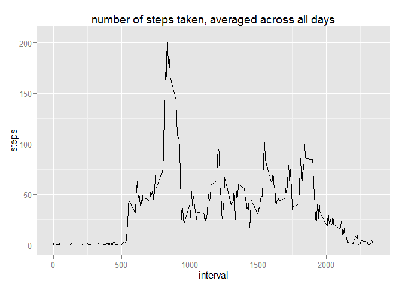
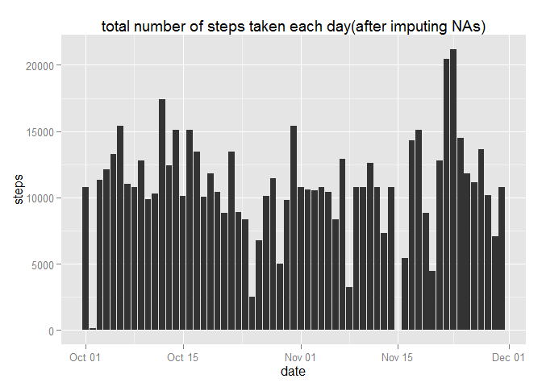

# Reproducible Research: Peer Assessment 1

Setting global options to set warnings to false

```r
knitr::opts_chunk$set(warning=FALSE)
```

## Loading and preprocessing the data
Following code reads the data into a variable named data. No extra processing was needed except changing the date column to a field of type date rather than a string.

```r
unzip("activity.zip")
data<- read.csv("activity.csv")
data$date <- as.Date(as.character(data$date))
```


## What is mean total number of steps taken per day?
FOllowing is the code to plot the required histogram:

```r
library(ggplot2)
qplot(date, steps, data = data, geom = "histogram", stat = "identity", main= "total number of steps taken each day")
```

 

Mean and median can be calculated using the mean and median function. Here, I have used the summary function instead as it presents both mean and median but also includes other important details about the data.

```r
dataperday <- aggregate( steps ~ date, data, sum)
summary(dataperday$steps)
```

```
##    Min. 1st Qu.  Median    Mean 3rd Qu.    Max. 
##      41    8841   10760   10770   13290   21190
```


## What is the average daily activity pattern?
Following code calculates the average daily activity pattern and plots the required time series plot:

```r
library(ggplot2)
dataperinterval <- aggregate( steps ~ interval, data, mean)
qplot(interval, steps, data = dataperinterval, geom="line", main="number of steps taken, averaged across all days")
```

 

Interval with maximum average daily activity can be calculated as follows.

```r
dataperinterval[which.max(dataperinterval$steps),"interval"]
```

```
## [1] 835
```
## Imputing missing values

Missing values are imputed with the average daily activity for the interval.

```r
library(ggplot2)
NAvalues <- is.na(data$steps)
sum(NAvalues)
```

```
## [1] 2304
```

```r
#Imputes all the missing values with the average daily activity during that interval over the days.
imputeNA <- function(input, map){
      for( i in 1:nrow(input)){
            if(is.na(input[i,"steps"]))
                  input[i,"steps"] <- map[map$interval == input[i,"interval"], "steps"]
      }
      input
}
out <- imputeNA(data, dataperinterval)
```

Requireed histogram is ploted by the following code:

```r
qplot(date, steps, data = out, geom = "histogram", stat = "identity", main="total number of steps taken each day(after imputing NAs)")
```

 

Mean and median can be calculated wwith summary function.

```r
outdataperday <- aggregate( steps ~ date, out, sum)
summary(outdataperday$steps)
```

```
##    Min. 1st Qu.  Median    Mean 3rd Qu.    Max. 
##      41    9819   10770   10770   12810   21190
```

The following code tries to find the difference caused by imputing the NA values over total steps per day.

```r
dataperday <- aggregate( steps ~ date, data, sum, na.action = na.pass)
outdataperday$originalSteps <- dataperday$steps
outdataperday$diff <- outdataperday$steps - outdataperday$originalSteps
qplot(date, diff, data = outdataperday, geom="line", main="difference between total steps per day(before and after imputing NAs)")
```

 

It becomees apparent from the graph that no imputing NA values caused no difference as all the values were provided or neither of the values were provided for a particular day. The gaps are the NA values.

## Are there differences in activity patterns between weekdays and weekends?
Following code tries to show the difference in the activity pattern between weekdays and weekends:

```r
data$day <- weekdays(data$date)
weekend <- data$day == "Saturday" | data$day == "Sunday"
data$isWeekend <- as.numeric(weekend)
data$isWeekend <- factor(data$isWeekend, labels=c("Weekend", "Weekday"))
dataperinterval <- aggregate( steps ~ interval+isWeekend, data, mean)
qplot(interval, steps, data = dataperinterval, geom="line", facets = isWeekend ~ ., main="average number of steps taken during each interval")
```

 

It is apparent that there is a spike in average daily movement during a particular interval during weekends and then the number of steps goes down but it is not so in the case of weekdays.
